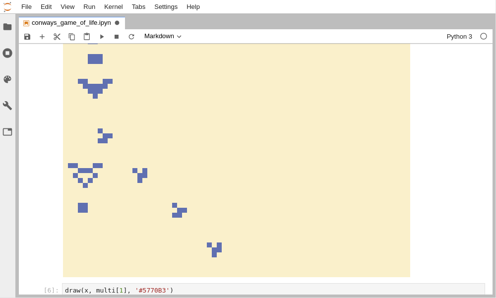
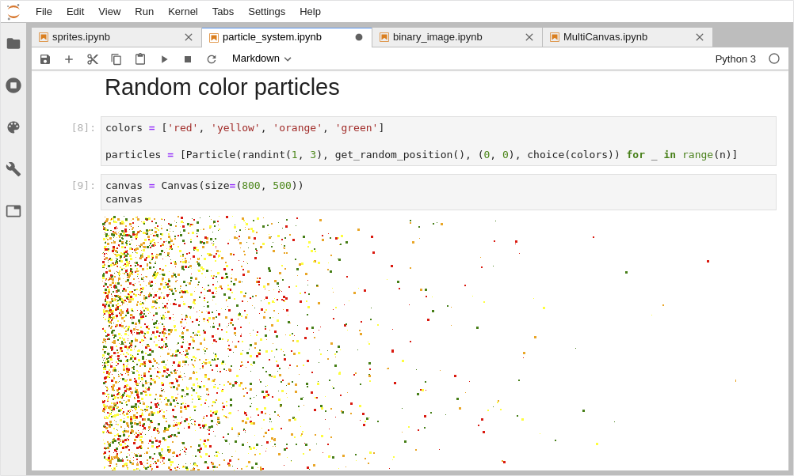

# ipycanvas

[](https://mybinder.org/v2/gh/martinRenou/ipycanvas/stable?filepath=examples)

Interactive widgets library exposing the [browser's Canvas API](https://developer.mozilla.org/en-US/docs/Web/API/Canvas_API) to Python. There are some API differences though:

- The `Canvas` widget is exposing the [`CanvasRenderingContext2D`](https://developer.mozilla.org/en-US/docs/Web/API/CanvasRenderingContext2D) API
- All the API is written in `snake_case` instead of `camelCase`, so for example `c.fillStyle = 'red'` becomes `c.fill_style = 'red'`
- The `Canvas` widget exposes a `clear` method, `c.clear()` is a shortcut for `c.clear_rect(0, 0, c.size[0], c.size[1])`
- We provide a `hold_canvas` context manager if you want to perform lots of commands at once
- The Web canvas `putImageData` method does not support transparency, our `Canvas.put_image_data` **does** support it!

## Examples

### Create John Conway's Game Of Life


### Draw Particles from IPython


### Custom Sprites


### Draw data directly from a NumPy array


## Installation

You can install using `pip`:

```bash
pip install ipycanvas
```

Or using `conda`:

```bash
conda install -c conda-forge ipycanvas
```

And if you use jupyterlab:

```bash
jupyter labextension install @jupyter-widgets/jupyterlab-manager ipycanvas
```

If you are using Jupyter Notebook 5.2 or earlier, you may also need to enable
the nbextension:
```bash
jupyter nbextension enable --py [--sys-prefix|--user|--system] ipycanvas
```

## Installation from sources

You can install using `pip`:

```bash
git clone https://github.com/martinRenou/ipycanvas
cd ipycanvas
pip install .
```

And if you use jupyterlab:

```bash
jupyter labextension install @jupyter-widgets/jupyterlab-manager
jupyter labextension install .
```

And you use the classical Jupyter:

```bash
jupyter nbextension install --py --symlink --sys-prefix ipycanvas
jupyter nbextension enable --py --sys-prefix ipycanvas
```
