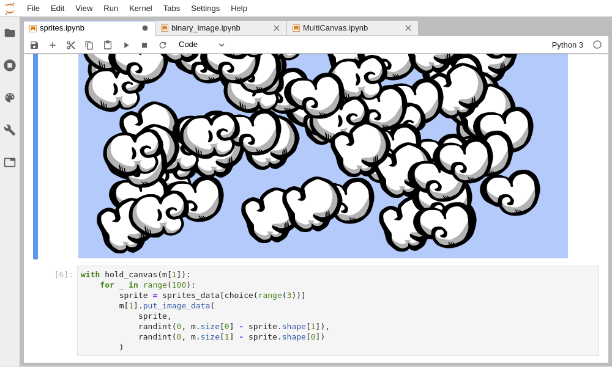
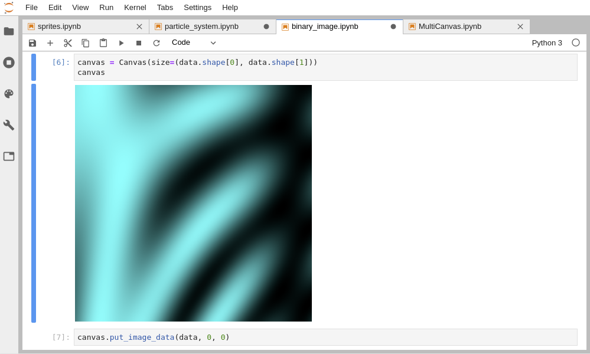

# ipycanvas

[](https://ipycanvas.readthedocs.io/en/latest/?badge=latest)
[](https://mybinder.org/v2/gh/martinRenou/ipycanvas/stable?filepath=examples)
[](https://travis-ci.org/martinRenou/ipycanvas)

Interactive Canvas in Jupyter.

ipycanvas is an Interactive widgets library exposing the [browser's Canvas API](https://developer.mozilla.org/en-US/docs/Web/API/Canvas_API) to Python.
It allows you to draw simple primitives directly from Python like text, lines, polygons, arcs, images etc.

## Try it online!

You can try it online by clicking on this badge:

[](https://mybinder.org/v2/gh/martinRenou/ipycanvas/stable?filepath=examples)

## Documentation

You can read the documentation following this link: https://ipycanvas.readthedocs.io/en/latest/

## Examples

### Create John Conway's Game Of Life


### Draw Particles from IPython


### Custom Sprites


### Draw data directly from a NumPy array


## Installation

You can install using `pip`:

```bash
pip install ipycanvas
```

Or using `conda`:

```bash
conda install -c conda-forge ipycanvas
```

And if you use jupyterlab:

```bash
jupyter labextension install @jupyter-widgets/jupyterlab-manager ipycanvas
```

If you are using Jupyter Notebook 5.2 or earlier, you may also need to enable
the nbextension:
```bash
jupyter nbextension enable --py [--sys-prefix|--user|--system] ipycanvas
```

## Installation from sources

You can install using `pip`:

```bash
git clone https://github.com/martinRenou/ipycanvas
cd ipycanvas
pip install .
```

And if you use jupyterlab:

```bash
jupyter labextension install @jupyter-widgets/jupyterlab-manager
jupyter labextension install .
```

And you use the classical Jupyter:

```bash
jupyter nbextension install --py --symlink --sys-prefix ipycanvas
jupyter nbextension enable --py --sys-prefix ipycanvas
```
